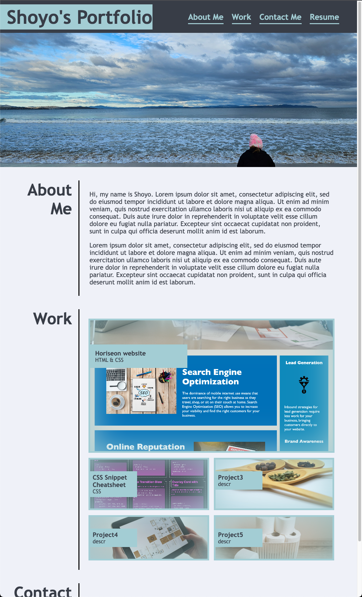

# portfolio-shoyo

## Description

This Website is my personal portfolio that consits of some information about me and a list of projects that I have made and contributed to

## Web image

## Credits

All assets and initial code are from the Bootcamp's weekly challenge "2-Advanced-CSS/2-Challenge" repository

Info and tutorial regarding HTML Semantics are from https://www.w3schools.com/html/html5_semantic_elements.asp

Info on flexbox https://developer.mozilla.org/en-US/docs/Web/CSS/CSS_flexible_box_layout/Basic_concepts_of_flexbox

Info on transitions https://www.w3schools.com/css/css3_transitions.asp

## License

Please refer to LICENSE in the repo